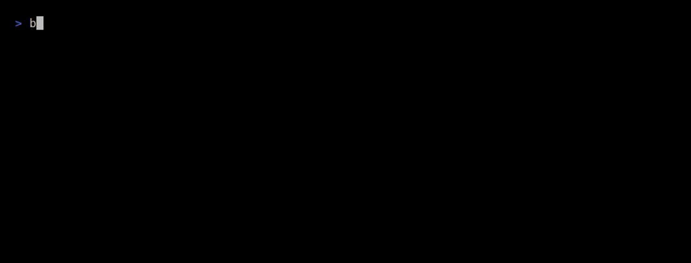

<p align="center">
  
</p>

<h1 align="center">mojo-dllm</h1>

<p align="center"><em>Local inference for diffusion language models, written in Mojo.</em></p>

<p align="center">
  <a href="https://github.com/vladimirrott/mojo-dllm/actions/workflows/ci.yml"></a>
  <a href="LICENSE"></a>
  
  
</p>

<p align="center">
  <a href="#benchmarks">Benchmarks</a> ·
  <a href="#quick-start">Quick start</a> ·
  <a href="#how-it-works">How it works</a> ·
  <a href="#correctness">Correctness</a> ·
  <a href="#status">Status</a> ·
  <a href="docs/introduction.md">Docs</a>
</p>

<p align="center">
  
</p>

mojo-dllm runs **LLaDA-8B** and **Dream-7B**, two diffusion language models,
from quantized GGUF files on your CPU or on an NVIDIA GPU. The GGUF reader,
the tokenizer, the quantized matrix multiply, the GPU kernels, the transformer
and the denoising loop are all Mojo. You need no Python at runtime, and the
GPU is optional.

A diffusion model does not write left to right. It starts from a canvas of
masked tokens and, over a fixed number of steps, commits the tokens it is most
sure about until none are left. Every step reruns the whole model over the
whole canvas, so the runtime problem looks like a stream of GEMMs. mojo-dllm
is built around that.

## Benchmarks

<!-- bench:start -->
**LLaDA-8B-Instruct**, Q4_K_M. 13th Gen Intel(R) Core(TM) i5-13420H, 12 threads, 33.3 GB RAM, `performance` power profile. Each prompt: 128 generated tokens, 32 denoising steps; median of 3 runs x 3 prompts.

| Runtime | ms / step | tokens / s | startup | peak RSS | language |
|---|---:|---:|---:|---:|---|
| **mojo-dllm** | 3,005 | 1.33 | 1.8 s | 5.9 GB | Mojo |
| mojo-dllm, logits for every position (ablation) | 3,268 | 1.22 | 1.8 s | 5.9 GB | Mojo |
| llama.cpp `llama-diffusion-cli` | 5,807 | 0.69 | 2.5 s | 8.4 GB | C/C++ |
| diffuse-cpp, cache off | 9,996 | 0.40 | 2.3 s | 8.2 GB | C++ |
| diffuse-cpp, cache + `entropy_exit` † | 4,380 | 1.12 | 2.6 s | 8.4 GB | C++ |

Versions: mojo-dllm `bdd268b`, Mojo 1.1.0 (8189361e), llama.cpp `836d571`, diffuse-cpp `1d2bd6a`. Evidence: `bench/results/2026-10-03-cpu-diffuse.json`, `bench/results/2026-10-03-cpu-llada.json`.

† Not the same work: the inter-step cache reuses stale K/V and `entropy_exit` can stop early. Shown because it is diffuse-cpp's recommended mode.

**Dream-v0-Instruct-7B**, Q4_K_M. 13th Gen Intel(R) Core(TM) i5-13420H, 12 threads, 33.3 GB RAM, `performance` power profile. Each prompt: 128 generated tokens, 32 denoising steps; median of 3 runs x 3 prompts.

| Runtime | ms / step | tokens / s | startup | peak RSS | language |
|---|---:|---:|---:|---:|---|
| **mojo-dllm** | 2,967 | 1.35 | 1.7 s | 5.6 GB | Mojo |
| llama.cpp `llama-diffusion-cli` | 5,566 | 0.72 | 2.5 s | 8.0 GB | C/C++ |

Versions: mojo-dllm `bdd268b`, Mojo 1.1.0 (8189361e), llama.cpp `836d571`. Evidence: `bench/results/2026-10-03-cpu-dream.json`.
<!-- bench:end -->

Every number above is rendered from a result file in `bench/results/`, and CI
fails if the table and the file disagree. [Benchmarks](docs/benchmarks.md)
explains the setup, including why each runtime's schedule differs and what
the ablation row measures.

## Quick start

```bash
git clone https://github.com/vladimirrott/mojo-dllm && cd mojo-dllm
pixi install && pixi run build

curl -L -o LLaDA-8B-Instruct.Q4_K_M.gguf \
  https://huggingface.co/mradermacher/LLaDA-8B-Instruct-GGUF/resolve/main/LLaDA-8B-Instruct.Q4_K_M.gguf

build/mojo-dllm run --model LLaDA-8B-Instruct.Q4_K_M.gguf \
  --prompt "Explain speculative decoding in two sentences." \
  --max-tokens 64 --steps 32 --verbose
```

You need Linux on x86-64 with AVX2 and about 6 GB of free memory. Pixi
installs the pinned Mojo toolchain into the project directory.

On an NVIDIA GPU with compute capability 8.0 or newer (RTX 30 series and
later), add `--device gpu`. The weights then live in GPU memory; if the card
has too little free, mojo-dllm says how much it needs and exits. The
[quick start guide](docs/quickstart.md) covers `inspect`, `tokenize` and the
flags.

## How it works

- **Weights repacked for a skinny GEMM.** At load, every Q4_K and Q6_K matrix
  is interleaved 8 rows per 256-bit register, so one AVX-VNNI `vpdpbusd`
  computes 8 rows × 4 multiply-adds against int8 activations. Q4_K stays
  4-bit. [The quantized GEMM](docs/kernels.md) has the layout.
- **Threads that suit hybrid CPUs.** Work goes out one item at a time from an
  atomic counter, so performance cores take more than efficiency cores.
- **Int8 tensor cores on the GPU.** With `--device gpu`, every projection
  reads the same Q4_K and Q6_K blocks from GPU memory and multiplies them on
  the tensor cores: one `mma` per 32-weight Q4_K sub-block, one per 16-weight
  Q6_K group. Attention gives each
  thread block 16 queries and streams the keys through shared memory.
  [The GPU path](docs/kernels.md#the-gpu-path) has the details.
- **Logits only where the sampler looks.** A step needs logits for the masked
  positions of the current block alone, so the 126 464-way output projection
  runs on those rows.
- **Each model's own sampler.** LLaDA's blocks and low-confidence remasking
  follow its `generate.py`; Dream's timestep schedule and entropy ranking
  follow its `diffusion_generate`.

[Diffusion decoding in five minutes](docs/diffusion.md) explains the
algorithm, and [Architecture](docs/architecture.md) maps the source.

## Correctness

mojo-dllm checks itself against code it does not share:

- decoders and GEMMs against the `gguf` package's dequantization;
- a 2-layer model's forward pass against numpy;
- both tokenizers against `llama-tokenize` on 36 multilingual cases each, id
  for id;
- logits and generated tokens on both real models against llama.cpp;
- every GPU kernel against the CPU function it replaces, and GPU logits
  against llama.cpp.

[Correctness](docs/correctness.md) has the measured agreement and the commands
that reproduce it.

## Status

Version 0.1 runs on the CPU. `main` adds an NVIDIA backend (`--device gpu`,
compute capability 8.0 and newer). Both run LLaDA-8B and Dream-7B from GGUF
files whose tensors are F32, Q4_K or Q6_K.

| Milestone | State |
|---|---|
| GGUF inspection, Q4_K / Q6_K kernels | done |
| LLaDA forward pass, logit parity with llama.cpp | done |
| Tokenizer, diffusion sampler, `mojo-dllm run` | done |
| CPU optimization and benchmark report | two rounds done |
| Dream-7B (GQA, QKV bias, shifted logits, its sampler) | done |
| NVIDIA backend (int8 tensor cores) | done on `main` |
| Inter-step caching, block diffusion | research |

The [plan](docs/plan.md) lists what the original
[specification](docs/spec.md) got wrong and how the code handles it.

## Contributing

Start with [CONTRIBUTING.md](CONTRIBUTING.md). The short version:

```bash
pixi install
scripts/ci-local.sh --install-hooks   # pre-commit: fast gates, pre-push: all of them
scripts/ci-local.sh                   # what CI runs
```

## License

Apache-2.0. See [LICENSE](LICENSE) and [NOTICE](NOTICE).

mojo-dllm builds with Modular's Mojo toolchain. The compiler and standard
library sources are Apache-2.0 with LLVM exceptions; the prebuilt packages and
runtime libraries that `pixi install` fetches ship under Modular's own terms,
summarized in NOTICE. LLaDA is by GSAI-ML and released under MIT.
