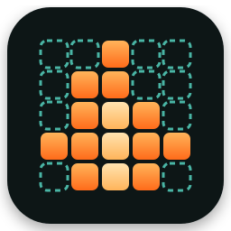

  
  
Local inference for diffusion language models, written in Mojo.

# Introduction

mojo-dllm runs **LLaDA-8B**, a diffusion language model, on your own CPU from a
quantized GGUF file. The whole inference path is Mojo: the GGUF reader, the
tokenizer, the quantized matrix multiply, the transformer and the denoising
loop. You need no Python at runtime and no GPU.

A diffusion language model writes differently from the models you know. An
autoregressive model appends one token at a time. LLaDA starts from a canvas
of `[MASK]` tokens and fills it in over a fixed number of steps, committing the
tokens it is most sure about first. [Diffusion decoding in five
minutes](diffusion.md) walks through it with a picture.

## What works today

- `mojo-dllm run` generates text from LLaDA-8B-Instruct Q4_K_M on x86 CPUs
  with AVX2 (AVX-VNNI used when present).
- The tokenizer matches llama.cpp id for id on a 35-case multilingual corpus.
- Logits match llama.cpp's LLaDA implementation on the real model; the
  measured agreement is in [Correctness](correctness.md).
- [Benchmarks](benchmarks.md) against llama.cpp and diffuse-cpp on the same
  machine, with every number generated from a result file in the repository.

## What does not work yet

- No GPU backend. The plan targets NVIDIA consumer cards next.
- One model architecture (LLaDA). Dream-7B is the planned second.
- One quantization mix: the F32, Q4_K and Q6_K tensors a Q4_K_M file
  contains. Any other tensor type stops the load with an error that names it.

## Where to go next

- Run it: [Quick start](quickstart.md).
- Read the numbers: [Benchmarks](benchmarks.md).
- Read the code: [Architecture](architecture.md), then the source under
  `src/mojo_dllm/`.
